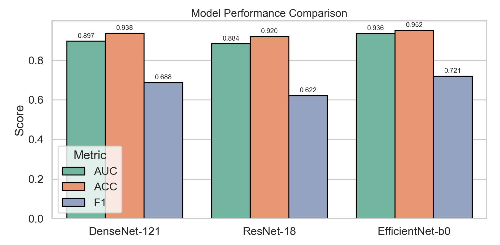

# hr-diagnosis-cnn
This repository implements a deep learning pipeline to predict hypertensive retinopathy (HR) using retinal fundus image data.

## Project Structure
```
HR-DIAGNOSIS-CNN
├── assets
├── dataset
│   ├── testing
│   │   ├── 1.png
│   │   ├── 2.png
│   │   ├── ...
│   ├── training
│   │   ├── 1.png
│   │   ├── 2.png
│   │   ├── ...
│   └── validation
│   │   ├── 1.png
│   │   ├── 2.png
│   │   ├── ...
|   ├── test.csv
|   ├── train.csv
|   ├── validate.csv
├── densenet-121
│   ├── test.py
│   └── train.py
├── efficientnet-b0
│   ├── test.py
│   └── train.py
├── resnet-18
│   ├── test.py
│   └── train.py
├── .gitignore
├── dataset.py
├── graph-view.py
├── README.md
└── requirements.txt
```

## How to run?
1. Run `database.py` to generate the proxy labels and prepare the dataset.
2. Execute any of the `train.py` scripts to train a model.
3. Finally, run `test.py` to evaluate the trained model.

> [!IMPORTANT]
> Make sure all dependencies are installed and the dataset is in place before running.

## Comparison


| Model           | AUC    | ACC    | F1     |
|----------------|--------|--------|--------|
| DenseNet-121   | 0.8968 | 0.9375 | 0.6875 |
| ResNet-18      | 0.8836 | 0.9203 | 0.6222 |
| EfficientNet-b0| 0.9359 | 0.9516 | 0.7207 |


## Dataset
Samiksha Pachade, Prasanna Porwal, Dhanshree Thulkar, Manesh Kokare, Girish Deshmukh, Vivek Sahasrabuddhe, Luca Giancardo, Gwenolé Quellec, Fabrice Mériaudeau (2020). Retinal Fundus Multi-disease Image Dataset (RFMiD). IEEE Dataport. [https://dx.doi.org/10.21227/s3g7-st65](https://dx.doi.org/10.21227/s3g7-st65)

## License
This project is private and not licensed for external use. Please contact the author for permissions.
